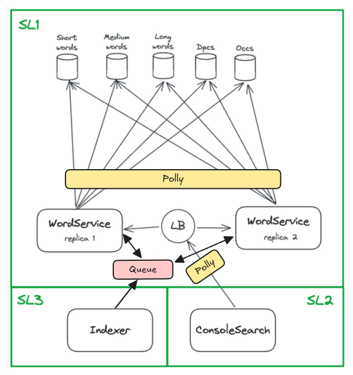

# W36 - Implement async design between your swimlanes

  

  

Indexer should post words to a queue or stream, which the WordServices consume at a moderate pace. this eases the peak load of the new words being indexed, and ensures that the WordServices remain available for the ConsoleSearch application. This queue scheme would also increase decoupling between the services, and enable more robust separation of swimlanes, SL1 and SL3.  

Polly fallback, retry, and Circuit Breaker mechanisms between WordService and databases can be added for extra control, but this is out of the scope of swimlanes, and does not provide any further swimlane isolation.

Between SL2 and SL1, fault isolation mechanisms retry, Circuit Breaker, and fallback (in that order) has been implemented. Between SL3 and SL1, no such mechanisms has been added, as retries would result in duplicate entries to the databases. The Circuit Breaker pattern becomes obsolete by the addition of the queue, unless the queue has downtime. Fallback is not needed as the Indexer's calls all are cases of Fire and Forget.
